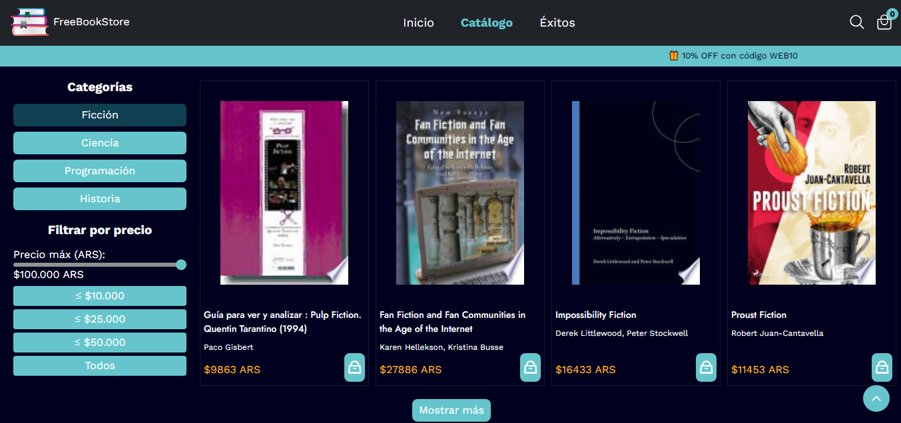

# E-commerce FreeBookStore

## Tienda ficticia de venta de libros online utilizando la Api de Google Books.
## Realizado con html, css y js vanilla.

### Demo: [FreeBookStore](https://book-api-gilt-three.vercel.app/)

 

---

### Recursos utilizados

- [Google Books](https://developers.google.com/books/docs/v1/using)
- [RemixIcons](https://remixicon.com/)
- [Ionicons](https://ionicons.com/)
- [Toastify](https://github.com/apvarun/toastify-js)
- [Sweet Alert](https://sweetalert2.github.io/)
- [Google Fonts](https://fonts.google.com/)
- [Google Books API](https://googleapis.com)
- [Dolar API](https://dolarapi.com/)
- [PNGEgg](https://www.pngegg.com/es)

---

**Realizado por:** [Patricia Atanasoff](https://github.com/Scripts24)

**Contacto:** 
- Whatsapp: [5492215657734](https://wa.me/5492215657734) 
 - Correo: [pato.atanasoff0815@gmail.com](mailto:pato.atanasoff0815@gmail.com)
